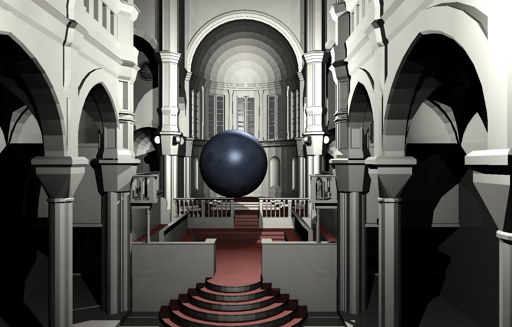
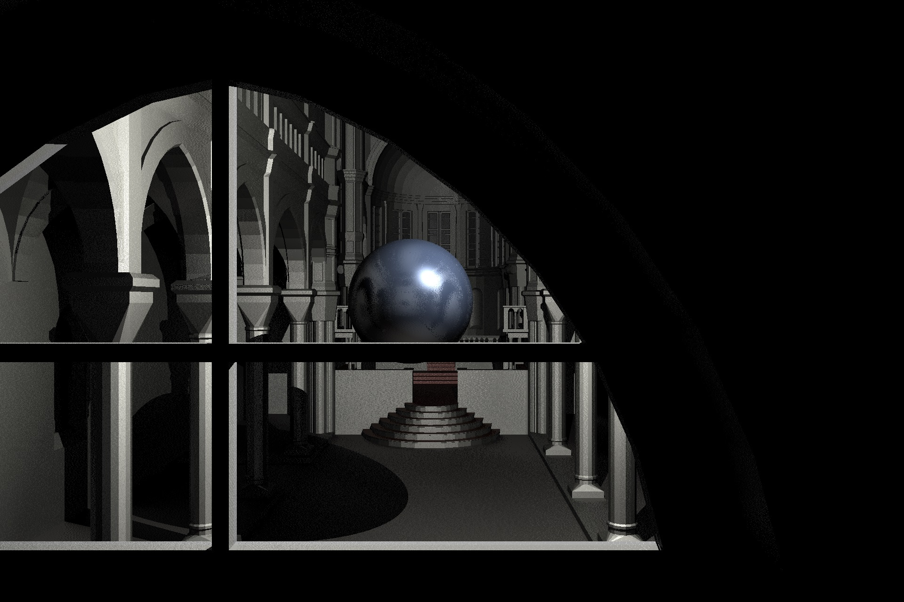
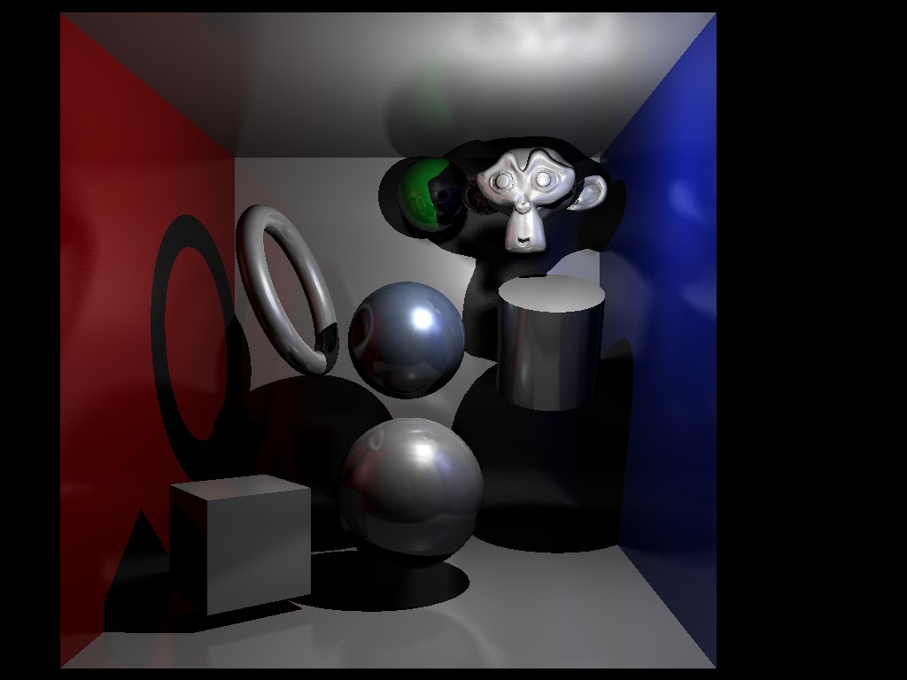

####CPU bound offline raytracer

Cross platform, including emscripten.

Exports video of keyframe animated scenes to MJPG AVI, and individual frames to PNG.

Also gbuffer textures that could be used for deferred rendering. 

######CLI:
* -mMODE (v for video, p for picture and g for gbuffer)
* -wWIDTH and -hHEIGHT
* e.g. raytracer -mp -w1280 -h720

######TODO:
* kdtree, store in continous memory with nodes of 8 bytes
* finish gbuffer output mode (handling znear/zfar)
* complete command line inferface
* multithreading
* blender exporter for scene and keyframes
* consider using a scripting language to describe scene input
* fix math bug revealed when gcc optimisations enabled and when using emscripten, also some triangle face normals from the room mesh appear to have length 0
* look at various material models
* global illumination, path tracing
* use quaternion slerp for keyframing rotations
* anti-aliasing
* look at using relief maps via ray marching

######Screenshots:

